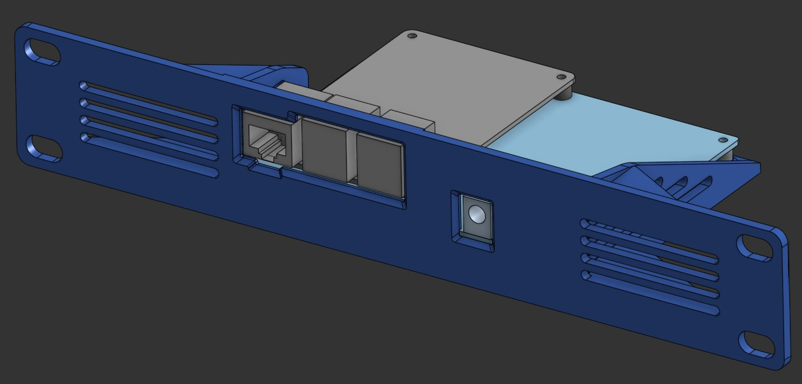
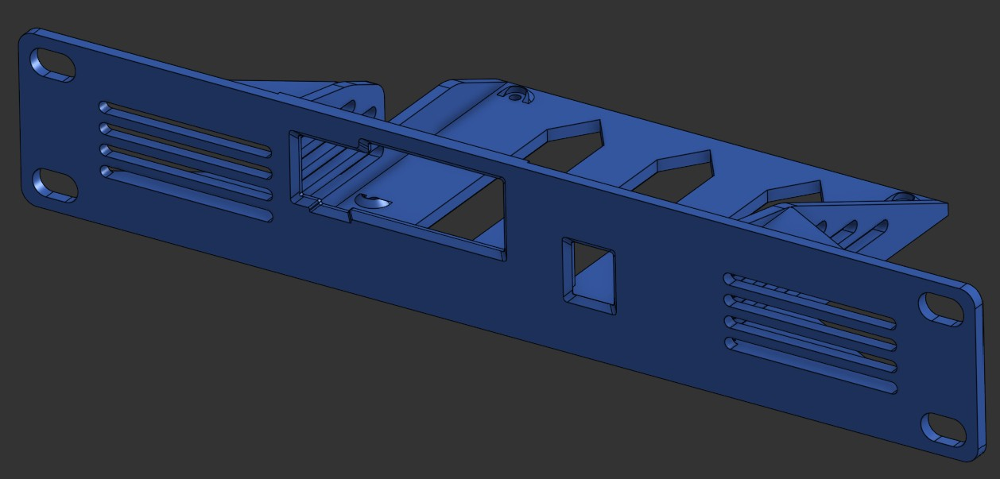
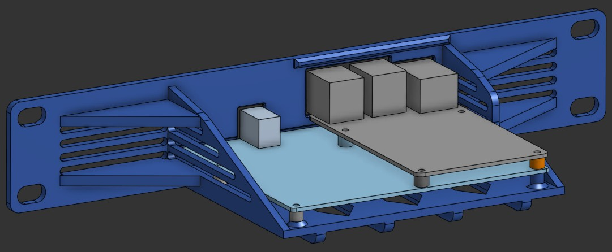
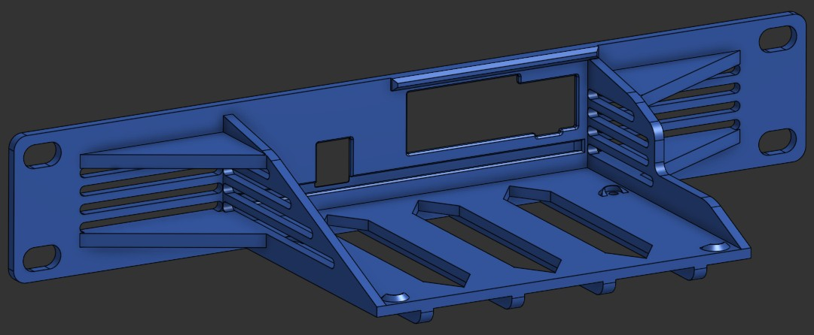

# [Geekworm X1011 PCIe 4 x NVMe](./STLs/geekworm_X1011_4xNVMe_10in_1U.stl)

This setup uses the [Geekworm X1011 PCIe board](https://www.amazon.co.uk/Geekworm-X1011-Peripheral-Raspberry-Support/dp/B0D6YRHNG5) and a Raspberry Pi 5 for a compact home NAS.

## Work in Progress
This is still a work in progress and I am yet to get this STL printed and check fitment.

