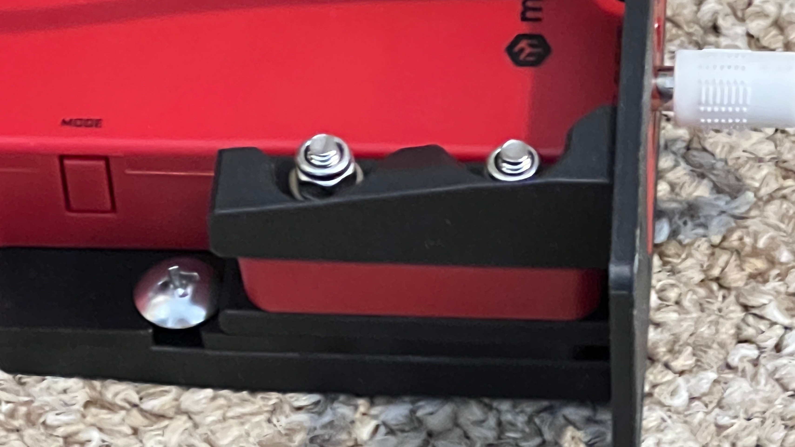
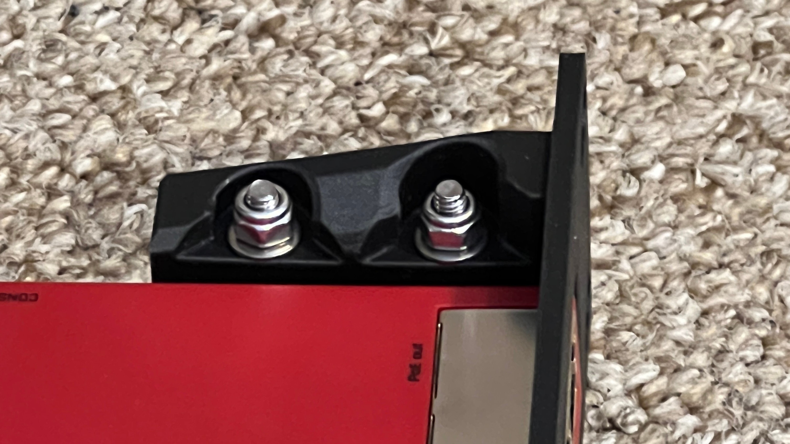
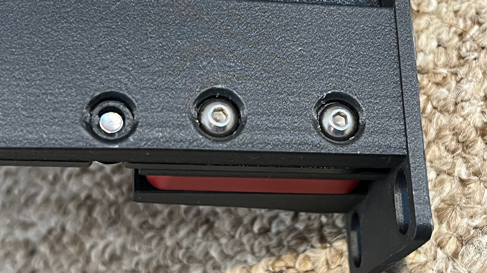
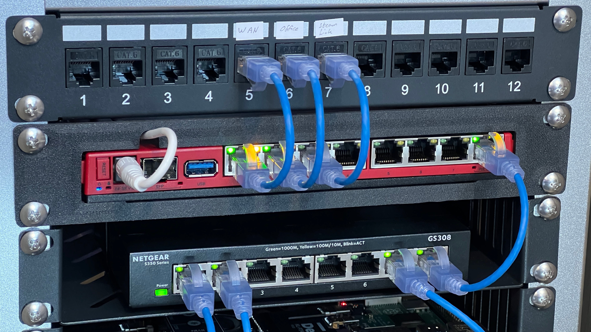

# [Mikrotik L009/RB5009 Router 10" Mount](./STLs/mikrotik_L009_10in_1U.stl)

## Compatibility
This mount was designed for and tested with the [Mikrotik L009UiGS-2HaxD-IN](https://mikrotik.com/product/l009uigs_2haxd_in), but should fit;
- [L009UiGS-RM](https://mikrotik.com/product/l009uigs_rm)
- [L009UiGS-2HaxD-IN](https://mikrotik.com/product/l009uigs_2haxd_in)
- [RB5009UG+S+IN](https://mikrotik.com/product/rb5009ug_s_in)
- [RB5009UPr+S+IN](https://mikrotik.com/product/rb5009upr_s_in)

which all appear to share the same form factor. The base version of the mount has a cut-out for the power cable to pass through, there is a version [here](./STLs/mikrotik_L009_10in_1U_no_cable_hole.stl) without the cut-out if the power cable is not needed (eg. if using PoE, or the side power plug on the RB5009 based routers).

This has not been test-fitted on the RB5009 routers, looking at the [dimensions datasheets](https://cdn.mikrotik.com/web-assets/product_files/RB5009INDimensions1_210954.pdf) it appears that the side power socket will be clear of the mounting arms, but probably worth taking some measurements with the power plug fitted and trial prints, and the rear screws may need to be left out (see below)

## Mounting
This is intentded to be used with [35mm M4 bolts](https://www.amazon.co.uk/dp/B0D8X6M9YT) with a max head diameter of 8mm. The bolts pass through all three mount arms and the router to clamp the router in place and spread the weight across the entire height of the face plate. The top recesses have clearance for a 7mm socket for tightening the nuts.

The other two holes at the rear line up with the mounting cut-outs on the router base, these are sized for the 10-32 mounting screw (which come with GeeekPi's racks) to bite in to the plastic, it's meant to help stop the router sliding back and does not need to be cranked down too tight, and can likely be skipped as the clamps hold the router fairly firmly. These will likely need to be left out if you want to use the side power connection on the RB5009 routers.

_Note: The power cable cut-out is incorrectly placed in these images and has been corrected in the STL._

## Printing Notes
The Mikrotik L009 and RB5009 series are designed to use the entire base as a heatsink and they will passively pass heat on to whatever they are mounted to. So I would suggest that you make sure to use a filament/3D print method which will hold up to being constantly warm.

My version was printed using;
- PLA-CF filament (carbon fiber)
- 50% cubic infill
- 8 wall loops
- 2 skirt loops
- support enabled (for bolt holes)

A decent wall thickness needed to ensure strength in the material under the bolts/nut heads, whilst not wasting material on the face plate which carries no load. The carbon fiber filament is holding up well, its proven to be very strong, supporting the router in the rack with very little flex.

If you want to access the original design to make your own version, you can access it on OnShape [here](https://cad.onshape.com/documents/3eef37720806aee14195c4ce/w/a88853328feb153d1102dc91/e/84ada9d315f747e53ca1347e).
